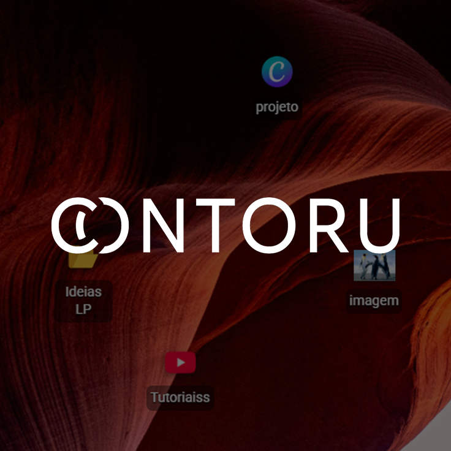
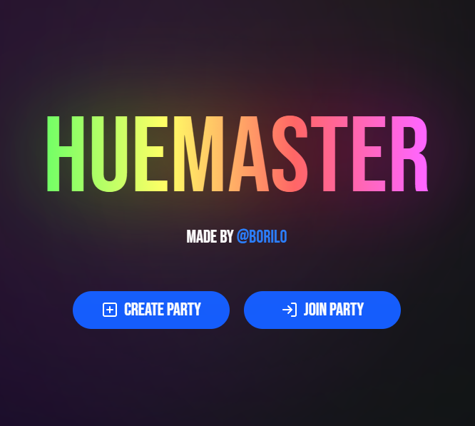
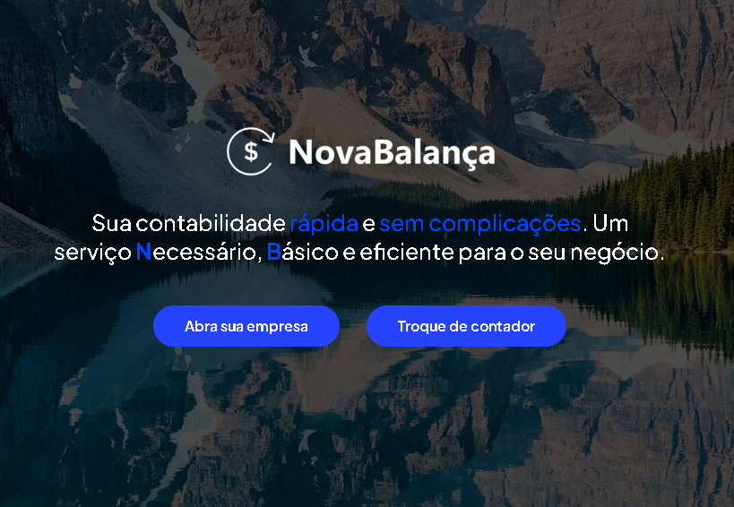

# Murilo Martins
**`Desenvolvedor Full-Stack`**

- Cursando Engenharia de Software na Universidade La Salle.
- Experiência com desenvolvimento de aplicações, manutenção e automação de processos.
- Construção de plataformas web, integrações via APIs REST (n8n) e administração de bancos de dados.

  

 

**Outros conhecimentos:** HTML, Vite, WordPress, Axios, Cloudflare Workers, Vercel, Render, Firebase, Figma, Jira, Elementor, RD Station, Discord, n8n.

---

## Projetos

<table width="100%">
  <tr width="100%">
    <td align="center" width="33%">
      <a href="https://contoru.vercel.app/">
        <!-- Substitua o link da imagem abaixo por uma print real do seu projeto -->
        
      </a>
       
      <b>Contoru</b> 
      Aplicação Web. 
      <a href="https://contoru.vercel.app/">Acessar Projeto</a>
    </td>
    <td align="center" width="33%">
      <a href="https://huemaster.vercel.app/">
        <!-- Substitua o link da imagem abaixo por uma print real do seu projeto -->
        
      </a>
       
      <b>HueMaster</b> 
      Plataforma interativa. 
      <a href="https://huemaster.vercel.app/">Acessar Projeto</a>
    </td>
    <td align="center" width="33%">
      <a href="https://boriloo.github.io/NovaBalanca-Contabilidade/">
        <!-- Substitua o link da imagem abaixo por uma print real do seu projeto -->
        
      </a>
       
      <b>NovaBalança Contabilidade</b> 
      Site Institucional. 
      <a href="https://boriloo.github.io/NovaBalanca-Contabilidade/">Acessar Projeto</a>
    </td>
  </tr>
</table>

---

## Contato

- [**Portfólio**](https://boriloo.github.io/portfolio)
- [**E-mail**](mailto:muriloomartins00@gmail.com)

